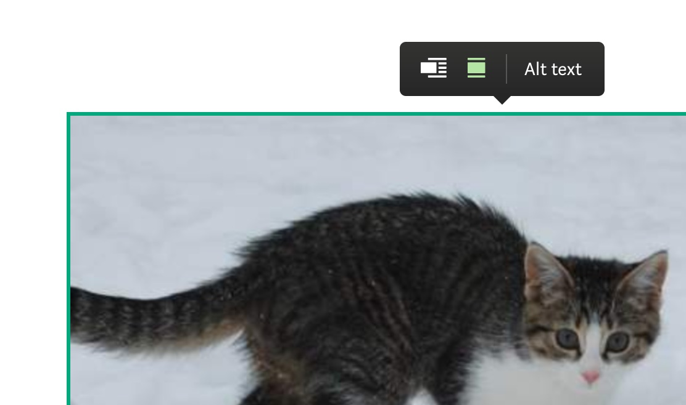
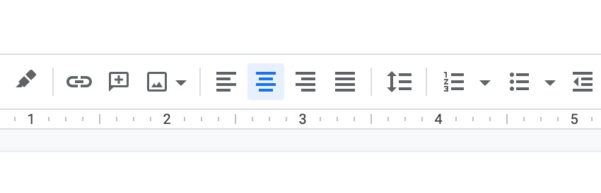

If you're building an app that features a rich text editor - you should make them as accessible as possible for screen-readers.

The following is a list of 10 recommendations for building accessible rich text editors. Although most points will be applicable to any kind of library you use, some of them are specific to building editors with react.js.

### 1. Test with an actual screen reader

If you have never used a screen reader, stop what you're doing and try to use your app or [any](https://docs.google.com/) app [with](https://medium.com/) that has a [rich text editor](https://www.notion.so/) with a screen reader. I'd consider this blog-post a success even if you don't come back to finish reading it.

- On __OSX__ you already have one built in to your operating system: [VoiceOver](https://support.apple.com/en-gb/guide/voiceover/welcome/mac).
- For __Windows__ users there's [nvda](https://github.com/nvaccess/nvda)(free) which is overall the most popular screen reader.
- A very popular screen reader is also [JAWS](https://www.freedomscientific.com/products/software/jaws/) (not free).

All of the below recommendations become more obvious if you put yourself into your users shoes.

### 2. Avoid keyboard traps

Overriding default keyboard behaviour to implement features such as hotkeys or indenting text via tab is a common pattern seen in web-based rich-text editors and IDEs.

However, screen-reader users rely entirely on the keyboard to navigate your app, their browser and operating system. It is extremely frustrating if default keyboard functionality is prevented by an application and hard to overcome. If you are implementing such features, check they don't collide with hotkeys that are already in use for the browser or operating system.

### 3. All interactive elements must be reachable via tab and/or arrow keys

Most rich text editing applications make use of menus and toolbars, dynamically positioned or fixed in place.

To ensure that elements are reachable via keyboard they need to be focusable. All interactive DOM elements are focusable by default (such as `button`, `input`, `select` or `textarea`). If you're using an element that isn't considered interactive (such as a `div`) you are required to add a `tabindex` and a `role` attribute so that the screen reader knows how to interact with the element.

Consider how much work it is for a keyboard-only user to navigate to these UI elements. This will depend on the position of this element in the DOM and how many other interactive elements are in between.

If you're building an editor with a floating toolbar (such as medium - which is completely inaccessible via tab keys btw) pay close attention to how a keyboard-only user can navigate to the buttons in this floating toolbar and how they can tab away from the toolbar and back to the editor once they interacted with it.

For complex usecases like the above you should consider programmatically moving focus, [more info on this here](https://developer.mozilla.org/en-US/docs/Web/Accessibility/Keyboard-navigable_JavaScript_widgets#managing_focus_inside_groups)

### 4. Use alt text for your images and make them configurable

If you're rendering images in your editor, it is recommended you [use an alt attribute](https://developer.mozilla.org/en-US/docs/Web/HTML/Element/img) to represent what the image contains to a screen reader.

However, for user submitted content it is too difficult to generate meaningful alt text automatically, that's why you should consider making the alt attribute configurable by the user. Here is what it looks like on medium.com:



### 5. Label your icon buttons

Most rich text editors make use of common icons for text formatting and layout.



These icons don't have textual meaning on their own, hence we need to tell the screen reader what they are by assigning the [`aria-label` attribute](https://developer.mozilla.org/en-US/docs/Web/Accessibility/ARIA/ARIA_Techniques/Using_the_aria-label_attribute) like so:

```tsx
<button aria-label="Bold" onClick={makeTextBold}>
  <MyIcon>
</button>
```

If you're not using the semantic `button` element, you need to assign the [`tabindex` attribute](https://developer.mozilla.org/en-US/docs/Web/HTML/Global_attributes/tabindex) (to make it tabbable) as well as the [`button` role](eb/Accessibility/ARIA/Roles/button_role) (to tell the screen reader that this is a button), see below:

```tsx
<span aria-label="Bold" role="button" tabindex="0" onClick={makeTextBold}>
  <MyIcon>
</span>
```

### 6. Use a linter with a11y support

To make it easier to stay on top of your apps accessibility, a linter can go a long way.

For react users, the [a11y-jsx eslint plugin](https://www.npmjs.com/package/eslint-plugin-jsx-a11y) will make you aware of what attributes you're missing to make your web-app accessible. I cannot overstate how valuable this is especially for teams.

I recommend running your linter automatically (either as part of your CI or in a git hook).

### 7. Use an accessible component library for building menu components

Building on established component libraries will give you a leg-up on reaching a good accessibility baseline. [Reach.ui](https://reach.tech/), [material ui](https://material-ui.com/) and [chakra](https://chakra-ui.com/) are all react libraries that have good accessibility defaults.

### 8. Think twice about whether you need collaborative text editing

If your rich text editor has collaborative editing the content of a users document can change at the same time as you're editing it. The screen-reader needs to be notified that these updates occur, however these notifications must not be too noisy or distracting which can be a difficult balancing act.

Although there are no out of the box solutions for this, a good reference is [googles live edits feature](https://workspaceupdates.googleblog.com/2019/08/real-time-collab-accessibility.html), providing a list of edits made by other users.

Features such as this can be notoriously expensive to implement, test and maintain. My recommendation: Think twice about whether you actually need collaboration as part of your product before adding it to your roadmap.

### 9. Use a title attribute for iframes

Embedding content via iframes is a staple for rich text editors these days. To make this accessible for screen readers you should use the [title attribute](https://www.w3.org/TR/WCAG20-TECHS/H64.html) to describe what the iframe contains.

### 10. Always use the `textbox` role

Most frameworks ([draft.js](https://draftjs.org/), [slate.js](https://www.slatejs.org/) and [prosemirror](https://prosemirror.net/) as well as others) render this by default, but it's always good to double check this!

Any rich text editor using the `contentEditable` attribute (which is pretty much every rich text editor) needs to use the ["textbox" role](https://developer.mozilla.org/en-US/docs/Web/Accessibility/ARIA/Roles/textbox_role), to tell the screen-reader that it will respond to input and editing commands.
