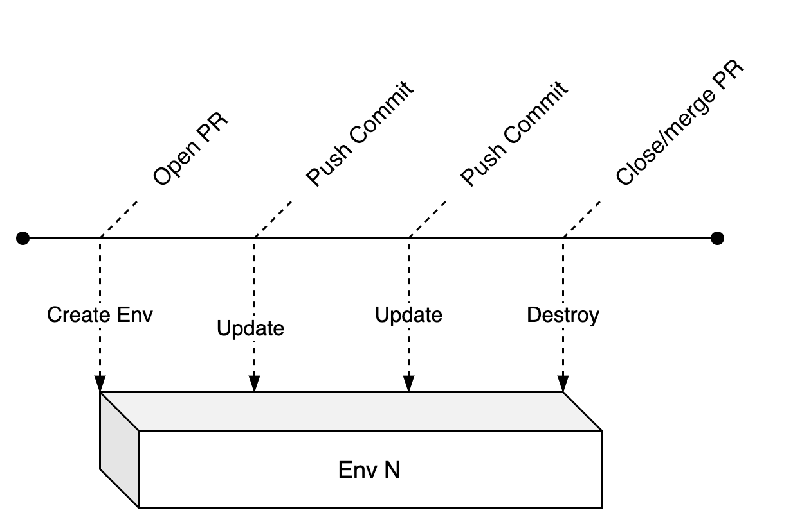

 

Using [Github Actions](https://github.com/features/actions) and [terraform](https://www.terraform.io/) - this post will guide you through automating the lifecycle of per pull request environments on github.

As a sidenote, short-lived environments go by many names, some of these are: feature environments, ephemeral environments, [review apps](https://devcenter.heroku.com/articles/github-integration-review-apps), on demand environments or temporary environments.

### What are short lived environments?

Say you're on a team that works on multiple features simultaneously. There is a need to share the work with colleagues in Engineering, Product, Design or QA to collaborate, test and review. That's where short lived environments come in. Their lifecycle is tied to that of the project.

### Why Infrastructure as Code?

Although terraform is my weapon of choice (material for an entirely new blogpost), there are plenty other tools out there (such as [pulumi](https://www.pulumi.com/) or [cloudformation](https://aws.amazon.com/cloudformation/) 😬).

The fact of the matter is - you should use IAC tools to maintain your sanity and this is especially true when it comes to managing short lived environments.

Although in this tutorial I am just provisioning an S3 bucket with terraform (for my blog), the same concepts can easily be mapped to any resources that terraform has modules for and [there are plenty](https://www.terraform.io/docs/providers/aws/index.html).

### Pre-requisities

- if you don't already have one yet, create an [aws account](http://aws.amazon.com/).
- make sure you add your aws credentials`AWS_ACCESS_KEY_ID` and `AWS_SECRET_ACCESS_KEY` [to your github repository secrets](https://help.github.com/en/actions/configuring-and-managing-workflows/creating-and-storing-encrypted-secrets).

### Github Actions to control the lifecycle of short lived environments.

We'll create 2 github actions to manage our environments. Github actions are basically `YAML` files that are located in `.github/workflows/`.

1. `create_and_update_pr_env.yml` - When a pull request is opened or updated, we want to create/update our infrastructure. `terraform apply` does both of that, simple!
2. `destroy_pr_env.yml` - When the pull request is closed, we need to destroy the environment to make sure we're not wasting resources (if we don't our AWS bill will be one nasty surprise).

### Defining the infrastructure with terraform

For this tutorial, we're using the terraform configuration for this blog. At the time of writing, here's how this looks like:

```terraform
provider "aws" {
  region = "eu-west-2"
}

terraform {
  backend "s3" {
    // make sure you'll replace the above
    // with a bucket name that fits
    bucket = "jkrsp-tf-state"
    region = "eu-west-2"
  }
}

variable "env_prefix" { }
variable "is_temp_env" {
  default = false
}
```

What do you think guys?

Wouldn't it be awesome if everyone got access to aws playground so we can get people involved and potentially excited about it :tada:  `

As you can see, we're using `s3` as our terraform backend. We're also defining two variables here `env_prefix` and `is_temp_env`. Next up you can see the only resource defined for this website, which is the we use for hosting the blog. The `env_prefix` variable is what we use to specify our environment-specific resource so we can avoid naming collisions.

`is_temp_env` is there to differentiate between production and a temporary environments. For temporary environments, we want to set `force_destroy` to `true`, so that we can easily destroy a bucket resource via terraform. If this is set to false, destroying the bucket will fail unless it is empty (which is exactly the kind of safety we want for production but not for a temporary environment)

```terraform
resource "aws_s3_bucket" "b" {
  bucket = "${var.env_prefix}jkrsp.com"
  acl    = "public-read"
  force_destroy = var.is_temp_env

  policy = <<POLICY
{
  "Version": "2012-10-17",
  "Statement": [
    {
      "Sid": "PublicReadGetObject",
      "Effect": "Allow",
      "Principal": "*",
      "Action": "s3:GetObject",
      "Resource": "arn:aws:s3:::${var.env_prefix}jkrsp.com/*"
    }
  ]
}
  POLICY

  website {
    index_document = "index.html"
  }

  tags = {
    ManagedBy = "terraform"
  }
}
```

At last, we're using an output variable to feed the url for our bucket website back to our github action, we'll use this later to display a link in the pr.

```terraform
output "website" {
  value = "http://${aws_s3_bucket.b.website_endpoint}"
}
```

Now that we have a basic terraform setup, let's create our actions...

### Creating/updating an environment when a PR is opened

First let's create a an action yml file `.github/workflows/create_and_update_pr_env.yml` with the following contents:

```yml
on:
  pull_request:
    types: [reopened, opened, synchronize, edited]
```

This block defines which events trigger the action (there's a more comprehensive list on [help.github.com](https://help.github.com/en/actions/reference/events-that-trigger-workflows)), in this instance the action gets triggered when a pull request has been opened, reopened, synchronized or edited.

Next we'll define the name of the action, the image being used for the action and the environment variables:

```yml
name: Create PR Env
jobs:
  create_or_update_pr_env:
    runs-on: ubuntu-latest
    env:
      AWS_ACCESS_KEY_ID: ${{ secrets.AWS_ACCESS_KEY_ID }}
      AWS_SECRET_ACCESS_KEY: ${{ secrets.AWS_SECRET_ACCESS_KEY }}
      BRANCH_NAME: ${{ github.head_ref }}
    steps:
      - ....
```

Github actions not unlike other CI tools are containerized - `ubuntu-latest` is our choice container image for this action. We've defined 3 variables, `AWS_ACCESS_KEY_ID` and `AWS_SECRET_ACCESS_KEY` we need for deploying to AWS via terraform. Terraform will automatically pick those up. We'll use the `BRANCH_NAME` env variable as a prefix for naming our temporary environment.

We're using github [actions context variables here](https://help.github.com/en/actions/reference/context-and-expression-syntax-for-github-actions), namely - `secrets` and `github`. Obviously the `secrets` variable refers to the github repo's secrets for your AWS secrets.

Next let's look at the actual steps:

First the build steps:

```yml
- name: Checkout
  uses: actions/checkout@v1
- name: Install Dependencies
  run: yarn
- name: Checkout
  uses: actions/checkout@v1
- name: Install Dependencies
  run: yarn
- name: Build Site
  run: yarn build
```

This is fairly standard, you'll always want to checkout your repository as a first step and install your dependencies. In this case I'm building a gatsby site, but this could just as well be any other app with a build step.

Once the site is built, we use terraform to orchestrate our deployment. Hashicorps' [github actions for terraform](https://github.com/hashicorp/terraform-github-actions) let you easily add any terraform command as a step. For this action, we'll use 4 commands: `init`, `plan`, `apply` and `output`.

The trick to achieving environments per pull request is to have different state files per environment as well as different names for resources. This is where the `BRANCH_NAME` variable comes in.

When initializing terraform we can pass in a `key` for an s3 bucket specific to this environment, pay attention to the `args` parameter to see how we achieve this by prefixing our key config with the `BRANCH_NAME` variable.

```yml
- name: 'Terraform Init'
  uses: hashicorp/terraform-github-actions@master
  with:
    tf_actions_version: 0.12.13
    tf_actions_subcommand: 'init'
    args: '-backend-config="key=${{ env.BRANCH_NAME }}.jkrsp.com.tfstate"'
```

Next we use terraform plan and pass in the `BRANCH_NAME` as a variable to parameterize our terraform config. Note that I also pass in a variable called `is_temp_env` - this I do because we want our temporary s3 resource to be deletable. Once we used plan we can follow up with `apply`.

```yml
- name: Terraform Plan
  uses: hashicorp/terraform-github-actions@master
  with:
    tf_actions_version: 0.12.13
    tf_actions_subcommand: 'plan'
    args: '-var="is_temp_env=true" -var="env_prefix=${{ env.BRANCH_NAME }}." -out tf.plan'
- name: Terraform Apply
  uses: hashicorp/terraform-github-actions@master
  with:
    tf_actions_version: 0.12.13
    tf_actions_subcommand: 'apply'
    args: 'tf.plan'
```

Next we use `output` to extract the website url of our s3 bucket. We'll come back to this in a bit, when we post the url of the temporary website as a comment on our pr. To output a single value we add our desired field name to `args`.

```yml
- name: Terraform Output
  id: terraform
  uses: hashicorp/terraform-github-actions@master
  with:
    tf_actions_version: 0.12.13
    tf_actions_subcommand: 'output'
    args: 'website'
```

Next we deploy our build to our s3 bucket via the cli. Again, we use our `BRANCH_NAME` env variable to specify the bucket or the environment.

```yml
- name: sync to s3
  run: aws s3 sync public s3://${{ env.BRANCH_NAME }}.jkrsp.com
```

As a final step in our action, I'm using a little JavaScript program to add a comment to the pr including the website.

```yml
- run: node .github/actions/comment.js
  env:
    github_token: ${{ secrets.GITHUB_TOKEN }}
    issue_number: ${{ github.event.pull_request.number }}
    repo: 'jkrsp'
    owner: ${{ github.repository_owner }}
    website_link: ${{ steps.terraform.outputs.tf_actions_output }}
```

The `comment.js` file is located in `.github/actions/comment.js` and looks like this:

As you can see passing in the parameters above will give the script all the variables it needs to post a comment.

```js
const github = require('@actions/github');

async function run() {
  const { issue_number, github_token, owner, repo, website_link } = process.env

  const octokit = new github.GitHub(github_token);

  try {
    const { data } = await octokit.issues.createComment({
      owner,
      repo,
      issue_number,
      // We unfortunately need to use replace to get rid
      // of extraneous double quotes
      body: `[Review website here](${website_link.replace(/"/gs, '')})`
    });

    // for debugging, lets log the created comment
    console.log('created comment', data);
  } catch (err) {
    throw err
  }
}

run();
```

That's it. Having added this to your github repository should create your environment and display a link to the bucket website when you open a pr.

But how do we get rid of the environment once we're done reviewing and the pr is closed/merged?

That's where our second action comes in:

### Destroying a short lived environment

First lets start of with the block that defines for which events our action gets triggered

```yml
on:
  pull_request:
    types: [closed]
```

Pretty self explanatory: This action gets triggered when a pull request has been closed.


Next up, like before - we name the action and the job and define our environment variables:

```yml
name: Destroy PR Env
jobs:
  destroy_pr_env:
    runs-on: ubuntu-latest
    env:
      AWS_ACCESS_KEY_ID: ${{ secrets.AWS_ACCESS_KEY_ID }}
      AWS_SECRET_ACCESS_KEY: ${{ secrets.AWS_SECRET_ACCESS_KEY }}
      BRANCH_NAME: ${{ github.head_ref }}
```

Now to the steps. First we need to check out our repo again:

```yml
- name: Checkout
  uses: actions/checkout@v1
  with:
    ref: ${{ github.head_ref }}
```

Then we start initializing terraform, again we use the `BRANCH_NAME` to specify the bucket for our environment

```yml
- name: 'Terraform Init'
  uses: hashicorp/terraform-github-actions@master
  with:
    tf_actions_version: 0.12.13
    tf_actions_subcommand: 'init'
    args: '-backend-config="key=${{ env.BRANCH_NAME }}.jkrsp.com.tfstate"'
```

Next we destroy the environment, passing in two variables - `is_temp_env` and `env_prefix`

```yml
- name: 'Terraform Destroy'
  uses: hashicorp/terraform-github-actions@master
  with:
    tf_actions_version: 0.12.13
    tf_actions_subcommand: 'destroy'
    args: '-var="is_temp_env=true" -var="env_prefix=${{ env.BRANCH_NAME }}."'
```

Finally, we comment on our pr again, to tell our colleagues that the environment has definitely been destroyed. Note how we pass in `secrets.GITHUB_TOKEN` - we need this token for any interaction with the github api.

```yml
- name: Tell PR that we have destroyed the thing
  uses: thollander/actions-comment-pull-request@master
  with:
    message: 'Temporary environment now destroyed'
    GITHUB_TOKEN: ${{ secrets.GITHUB_TOKEN }}
```

Right that's it. If you'd like to check out the workflows described in this blog post, please have a look a [the repository for this blog](https://github.com/juliankrispel/jkrsp/tree/master/.github/workflows).
