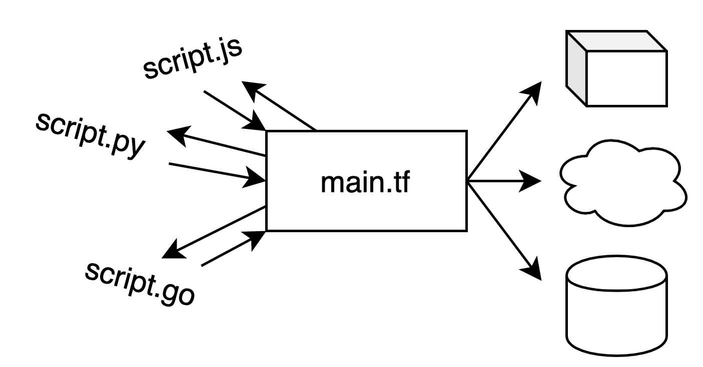

 

Sometimes my terraform modules depend on data not managed by a terraform provider but by a build step or a script in my repository. [External data sources](https://www.terraform.io/docs/providers/external/data_source.html) are an interface for running a command locally, on the machine that runs terraform, and providing the console output of that program as a data source.

## What is an `External Data Source`

It's a mechanism to allow a local script to act as a data source. All this local script needs to do to qualify as a valid data source is print JSON to standard out like this:

```javascript
console.log(JSON.stringify({ hello: 'world' }))
```

I love it when things are simple 🙌

It's meant to be used as an escape hatch and has limited capabilities. If this data source is complex and needs to be shared among projects, it might be a better choice to [implement a provider](https://www.terraform.io/docs/extend/writing-custom-providers.html) instead.

Personally I've found external data sources to be very useful when I want to roll a small build step into the provisioning step. Following are two examples, a simple hello world to get you started and then a more practical example (provisioning a lambda runtime for [deno](https://deno.land/))


All of the examples in this blogpost [are in this repository](https://github.com/juliankrispel/terraform-external-data-source-examples).

## Hello World external data source with node.js

Right, we have two files. First - `main.tf`, which simply uses an external data source to run a node script

```terraform
data "external" "js" {
  program = ["node", "${path.module}/data-source.js"]
}

output "external_source" {
  value = data.external.js.result
}
```

Our second file is `data-source.js`, which simply writes a json string `stdout`:

```javascript
console.log(JSON.stringify({ hello: 'world' }))
```

Provided you [have terraform installed](https://learn.hashicorp.com/terraform/getting-started/install.html), run `terraform init` and then `terraform apply` to see the following output:

```bash
Apply complete! Resources: 0 added, 0 changed, 0 destroyed.

Outputs:

external_source = {
  "hello" = "world"
}
```

I've also added hello world examples for [Go](https://github.com/juliankrispel/terraform-external-data-source-examples/tree/master/hello-world-go) and [Python](https://github.com/juliankrispel/terraform-external-data-source-examples/tree/master/hello-world-python) to the example repository.

## A more practical example: Provisioning a lambda layer with an external data source

In this example I want to provision a [deno](https://deno.land/) runtime for lambda and always use the latest release of the [said runtime from github](https://github.com/hayd/deno-lambda). Here are the steps to automate for this:

1. Download the lambda runtime layer.
2. Use the downloaded layer package as input for the aws resource `aws_lambda_layer_version`.
3. Associate the lambda layer with a lambda function resource.
4. Deploy with terraform.

First here's a simple node script to request the latest release (on github) of the deno lambda layer, download and write it to the file `lambda_layer.zip`. When the program is finished a json object with the filename is written to the console. If the script doesn't write json to the console, terraform commands will fail. Bear in mind that this is written using the node.js standard library, hence it's a little verbose.

```javascript
const https = require('https');
const fs = require('fs');

const file = fs.createWriteStream("lambda_layer.zip");
const options = { headers: { 'User-Agent': 'node-script' }}

https.get(
  // github's api for getting the latest releases of a repository
  "https://api.github.com/repos/hayd/deno-lambda/releases/latest",
  options,
  (res) => {
    res.setEncoding('utf8');

    let rawData = '';

    // since we're using the standard node interface
    res.on('data', (chunk) => { rawData += chunk; });
    res.on('end', () => {
      const parsedData = JSON.parse(rawData);

      const { browser_download_url } = parsedData.assets.find((asset) => 
        asset.name === 'deno-lambda-layer.zip'
      )

      https.get(
        browser_download_url,
        options,
      (res) => {
        // follow redirect if there is one
        if (res.statusCode === 302) {
        https.get(
          res.headers.location,
          options,
          (res) => {
            res.pipe(file)
            res.on('end', () => {
              console.log(JSON.stringify({ file: 'lambda_layer.zip' }))
            })
          })
      } else {
          res.pipe(file)
          res.on('end', () => {
            console.log(JSON.stringify({ file: 'lambda_layer.zip' }))
          })
        }
      });
    });
  }
)
```

Now in our terraform file we can declare the above node script as an external data source:

```terraform
data "external" "deno_layer" {
  program = ["node", "${path.module}/get-release.js"]
}
```

The object that the node script has printed to the console can now be accessed via `data.external.deno_layer.result`. Here's how we use it with our `aws_lambda_layer_version` resource:

```terraform
resource "aws_lambda_layer_version" "deno_lambda_layer" {
  filename   = data.external.deno_layer.result.file
  layer_name = "deno_lambda_layer"
  source_code_hash = filebase64sha256(data.external.deno_layer.result.file)
}
```

There's three attributes here:
1. The `filename` attribute will be used to point to the actual layer deployment package for upload
2. `layer_name` is the name of the lambda layer, you need to specify a unique name for your account.
3. `source_code_hash` is the value that determines when the resource should be updated. That means that if the contents of the file change, the resource will be updated too, if the contents are the same time as when we last ran terraform, the update will not be performed.

That's it, now we can use the lambda layer with a lambda function like so:

```terraform
resource "aws_lambda_function" "deno_lambda" {
  layers = [aws_lambda_layer_version.lambda_layer.arn]
}
```

That's it. For a full example including lambda function and IAM policies, check [out the repository](https://github.com/juliankrispel/terraform-external-data-source-examples/tree/master/deploy-lambda-with-latest-deno-layer).