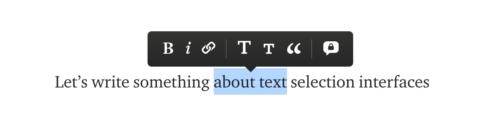

`use-text-selection` is a little react hook that gives you the position and dimensions, as well as the text content of a text selection.

You can use this with react based editing frameworks such as [slate.js](https://www.slatejs.org/) or [draft.js](https://draftjs.org/) or just by itself - depending on your usecase.

With this data you can create UI like the floating medium rich text menu:



Or autocomplete UI like you'd find in an IDE:


However, this UI doesn't have to be inside an editable text area. You can apply it to any text area, like mediums share/annotate menu when you select text:


And here's how simple it is to use:

```tsx
import { useTextSelection } from 'use-text-selection'

const MyTextSelectionComponent = () => {
  const { clientRect, isCollapsed } = useTextSelection()
  // to constrain text selection events to an element
  // just add the element as a an argument like `useTextSelection(myElement)`

  return <MyComponent
    style={{ left: clientRect.x, top: clientRect.y }}
  />
}
```

You can find the github [repository here](https://github.com/juliankrispel/use-text-selection/) along with a basic example. [The package is on npm](https://www.npmjs.com/package/use-text-selection) too.
