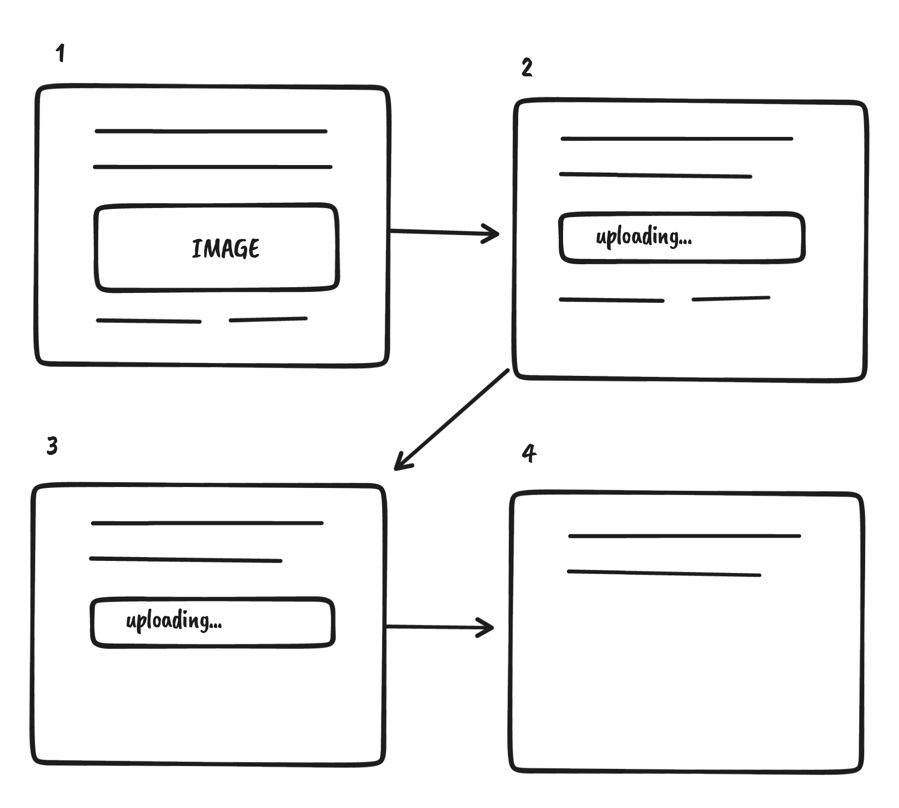

Asynchronous content in slate js is particularly tricky, let me explain why that is before we dive in.

For uploading media, the UX that users of rich text editors are used to goes like this:


1. The user uploads a file (either via drag and drop or via a file picker).
2. An element gets inserted into the editor that shows a loading state (such as a spinner).
3. The user can continue to edit the document, typing away merrily. Maybe they even accidentally delete the loading element and undo that again.
4. The loading element gets replaced with the uploaded image.

A naive implementation would look something like this (pseudo code):

```tsx
  const spinnerElement = insertLoadingSpinner()
  const media = await uploadMedia()
  replaceLoadingSpinnerWithMedia(
    spinnerElement,
    media
  )
```

All three steps above would be implemented using slate operations (using slate's `Transforms` api).

And if your editor (like most) uses the `slate-history` package, every operation will be persisted in slate's history object.
(Slate's history package adds undo and redo functionality to the editor).

The order of these operations matter, since every undo will apply the opposite of each operation in reverse order. Therefore the above flow when undone will behave something like this:



1. This is our start position, before we press undo, the image is in the editor, as expected.
2. Pressing undo once will undo the transforms applied in `replaceLoadingSpinnerWithMedia`, and turn the image back into a loading spinner. This is where it gets very confusing to the user, since they've already uploaded the image.
3. Pressing undo again will undo the text we entered during the upload.
4. Pressing undo a third time will undo the insertion of the loading spinner.

As you can see - this results in a broken user experience. The loading spinner should never re-appear since the image has already been uploaded.

In short - slate's change management isn't designed for asynchronous interactions and therefore needs to be extended for our use-case.

Fortunately, there is a simple abstraction we can use to solve this.

## Entities to the rescue - A missing feature in slate

I call this abstraction - `EntityState` - the same name that [draft.js](https://draftjs.org/docs/advanced-topics-entities/) uses for a similar abstraction. This use-case is one of the things that the draft.js architecture anticipated. It's built into draft.js's EditorState but is unfortunately missing in slate. That isn't such a huge issue though - because slate.js lends itself to be extended.

So what is entity state exactly?


- It's a state that is separate from the editor state.
- It can be implemented using whatever you prefer - redux, zustand or react state and context apis are all fair game.
- Every item in our EntityState has a unique id that is referenced from slate elements.
- All asynchronous data must be stored in entities rather than the editor state.

With a separate state for asynchronous data, we completely circumvent the problem described at the beginning.

Instead of the two slate operations:

1. Insert a loading spinner.
2. Replace the loading spinner with an image element once the image is uploaded.

We now have only one slate operation:

- Insert an element with an `entityId`.


Because the state of the entity is separate from that of the editor, any changes to it will be unaffected by undo or redo.

So that's it in theory. If you're anything like me however - you'll find this easier to understand when putting it in practice:

### Building an Editor with EntityState

Let's start out with a simple skelleton to render a slate editor. You can use my [slate-js-boilerplate](https://github.com/juliankrispel/slate-js-boilerplate) as a starting point if you like.

```tsx
const editor = useMemo<Editor>(
    () => withHistory(withReact(createEditor())),
    []
  );

  const [value, setValue] = useState<Node[]>([
    {
      children: [
        {
          text: "Hey there",
        },
      ],
    },
  ]);

  return (
    <Slate editor={editor} onChange={setValue} value={value}>
      <Editable placeholder="Write something..." />
    </Slate>
  );
```

In order to add elements that can have ids you'll need to extend your slate typescript declaration. Here's how mine looks like for this example

```tsx
// types.d.ts
import { BaseElement, BaseText } from "slate";
import { ReactEditor } from "slate-react";

declare module 'slate' {
  interface CustomTypes {
    Editor: ReactEditor
    Element: BaseElement & {
      id?: string
    }
    Text: BaseText 
  }
}

```

Now let's create the entity state. I'm going to choose [zustand](https://github.com/pmndrs/zustand) for the entity state, since it requires a lot less boilerplate than using react's context api:

```tsx
type Entity = {
  url?: string
}

type EntityState = {
  entities: {
    [entityId: string]: Entity;
  };
  upsertEntity: (entityId: string, entity: Entity) => void;
};

const useStore = create<EntityState>((set) => ({
  entities: {
    e1: {
      url: "https://placekitten.com/400/300",
    },
  },
  upsertEntity: (id, entity) =>
    set((state) => ({
      entities: {
        ...state.entities,
        [id]: entity,
      },
    })),
}));
```

That's all there is to creating the entity state. I'm only using an optional url attribute for my Entity type. If the url attribute is undefined we know that the upload is still ongoing.

The `upsertEntity` method will let us add and update entities.

You might have noticed that the store isn't empty but contains an example image of a kitten. Let's render this image in our editor before we move onto uploading things. I'll update our editor state to include a reference to the entity:

```tsx
  const [value, setValue] = useState<Node[]>([
    {
      children: [
        {
          text: "Hey there",
        },
      ],
    },
    {
      id: "e1",
      children: [],
    },
  ]);
```

As you can see I've added an element below our "Hey there" paragraph, the id of that element refers to the item in our entity state. Let's use this to render the element:

```tsx
<Editable
  renderElement={(props) => {
    const entity = useStore(
      (state) =>
        props.element.id != null && state.entities[props.element.id]
    );

    if (entity) {
      return (
        <figure {...props.attributes} contentEditable={false}>
          
          {props.children}
        </figure>
      );
    }

    return <DefaultElement {...props} />;
  }}
/>
```

`renderElement` is a prop on the Editable component which allows us to configure how slate renders it's "elements". This is the prop we need to render our image of a kitten.

Note that we're using our store to get the entity that our element refers to and if the store has our entity, we render it, otherwise we render the slate DefaultElement.

Don't forget to spread `props.attributes` on the element you're rendering as well as `contentEditable={false}`. This is needed to tell the browser that the content is in fact not editable - which is true for images. `{props.children}` is also needed so that slate renders without errors.

Additionally we need to tell slate that we're rendering a `void` element, which is jargon for non-text elements such as images. To do that we override the `isVoid` editor method:

```tsx
const editor = useMemo<Editor>(() => {
  const _editor = withHistory(withReact(createEditor()));
  const { isVoid } = _editor;
  _editor.isVoid = (el) => el.id != null || isVoid(el);
  return _editor;
}, []);
```

In this code snippet we're telling slate that every element that has an defined `id` attribute is also `void`.

Now you should see the kitten rendered in the editor:


### Uploading an entity

Let's implement the uploader and the loading state.

I'm going to use [filestack](https://www.filestack.com/) because they have a free tier and I can't be bothered to deal with the verbosity of the google apis.

First install and import the filestack module and initialize it with your api key (I had to sign up to get that).

```tsx
import { init } from 'filestack-js';
const filestack = init('<yourapikey>');
```

Then you define an event handler for file drops, namely the `onDrop` prop on the Editable component:

```tsx
<Editable 
  ...
  onDrop={(event) => {
    const files = Array.from(event.dataTransfer.items).map(
      (item) => item.getAsFile() as File
    )

    files.forEach(async (file) => {
      const id = nanoid()
      const entityState = useStore.getState()
      entityState.upsertEntity(id, {});
      Transforms.insertNodes(editor, { id, children: [{ text: "" }] });
      const uploaded = await filestack.upload(file)
      entityState.upsertEntity(id, { url: uploaded.url });
    });
  }}
  ...
```

What we're doing here is:

1. We're getting all the files from our event (located in event.dataTransfer.items). This is a special type that's why I'm using Array.from to convert it to an array.
2. Then I'm looping over them to upload the files.
3. For every element we create an id (I'm using the [nanoid](https://www.npmjs.com/package/nanoid) package to do this).
4. We're then using the upsertEntity method to create an empty entity and we insert the node with a reference to that entity.
5. We're uploading the file via `filestack.upload()` - pretty simple!
6. Once the file is uploaded we use the url in the response to update the entity.

This'll work as expected but one thing is missing - our loading state. To render a loading state we'll make a small update to our renderElement prop:

```tsx
...
{entity.url != null ? (
  
) : (
  <span>Uploading...</span>
)}
...
```

All we really need is to check if the url is defined or not.

- If it is we'll render the image.
- If url isn't define we'll render a component that signifies that the image is being uploaded.

To keep things simple I'm just rendering the word "Uploading..." but your designer probably has a better idea.
Also - don't forget to add an alt tag for accessibility.

Ideally - you'd make that editable too but that's for another tutorial.

That's a wrap, to see the entirety of this example, head over to my [slate patterns repository on github](https://github.com/juliankrispel/slate-patterns/blob/master/src/entities/entities.tsx).

### Things to keep in mind when implementing entity state

- Your schema for saving slate documents will now need to account for another json value that holds the entity state.
- Unused entities aren't removed automatically. This doesn't break anything but you can end up with extraneous data.
- To support copy and pasting entities between separate slate editors, the event handling needs to be extended, since slate doesn't know about our entity state.
