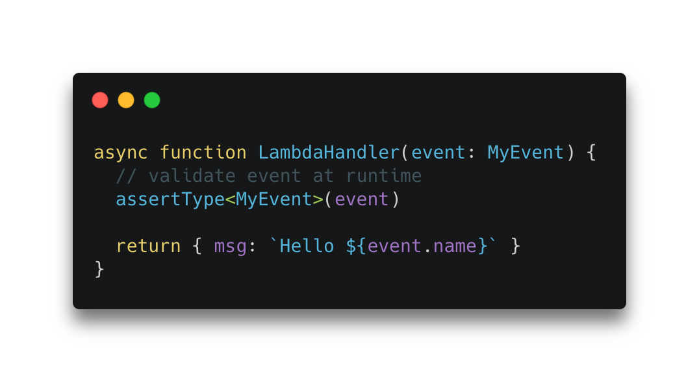

[typescript-is](https://github.com/woutervh-/typescript-is) is a library that enables you to perform runtime type checks in with typescript with just one line of code. 

Validating the input of cloud functions can be a challenging problem. Re-using your types to ensure that your input is type-safe is solves a big part of the validation problem. All you need to do is:

1. Import the library methods:

```ts
import { assertType } from 'typescript-is';
```

2. Use the `assertType` method to perform your runtime check

```ts
assertType<MyType>(input)
```

Above we use `assertType` to check whether our runtime object `input` matches our type `MyType`. If it doesn't match the `MyType` type, an error is thrown. `typescript-is` has a bunch of other methods such as `is` or `strictEqual`. If you'd like to throw the error yourself you could do this for example:

```ts
if (!is<MyType>(input)) {
  throw new Error('input does not match type')
}
```

That's pretty much all it takes to add validation to your cloud function (provided you are a typescript user 🙃). Whereas previously you might have reached for validation libraries such as [joi](https://github.com/sideway/joi) or god-forbid, written your own implementation, it's now just one line of code. What are you going to do with all this new-found time?

Below is an example of an entire AWS lambda function handler:

```ts
import { Handler } from 'aws-lambda'
import { assertType } from 'typescript-is';

type MyEvent = {
  msg: string
}

async function handler<Handler>(event: MyEvent) {
  assertType<MyEvent>(event)
  return { msg: 'Hello World' }
}

exports.handler = handler
```

If you'd like to just go ahead and deploy a lambda like this, please have a [look at my boilerplate](https://github.com/juliankrispel/typescript-aws-lambda-terraform) which also includes the `typescript-is` package to validate an example lambda. 
