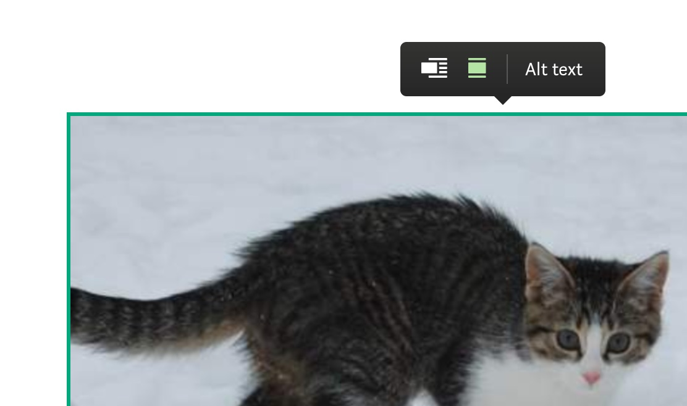
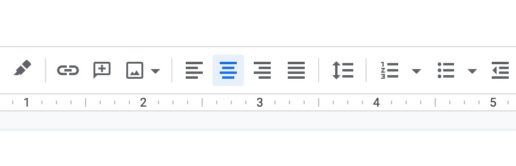

Rich text editors are among the most complex UI components to make accessible. Unlike simple forms or buttons, they require careful consideration of keyboard navigation, screen reader announcements, and dynamic content updates.

Making your editor accessible isn't just about compliance—it's about ensuring that users with disabilities can create and edit content effectively. This directly impacts your product's usability and your company's legal compliance.

The following is a list of __10 essential recommendations for building accessible rich text editors__. While most points apply to any framework, some examples are specific to React.js.

### 1. Test with an actual screen reader

If you've never used a screen reader, try one out on your app or any app with a rich text editor like [Google Docs](https://docs.google.com/), [Medium](https://medium.com/), or [Notion](https://www.notion.so/). This hands-on experience will immediately show you why accessibility matters.

- On __OSX__ you already have one built in to your operating system: [VoiceOver](https://support.apple.com/en-gb/guide/voiceover/welcome/mac).
- For __Windows__ users there's [nvda](https://github.com/nvaccess/nvda) (free) which is also the most widely used.
- Another popular screen reader is [JAWS](https://www.freedomscientific.com/products/software/jaws/) (not free).

All of the below recommendations become more obvious if you put yourself into your users shoes.

### 2. Avoid keyboard traps

Overriding default keyboard behavior to implement features such as hotkeys or indenting text via Tab is a common pattern in web-based rich-text editors and IDEs.

However, screen-reader users rely entirely on the keyboard to navigate your app, their browser, and operating system. It's frustrating and hard to overcome when default keyboard functionality is prevented by an application.

**Common keyboard trap scenarios:**
- Preventing Tab from moving focus away from the editor
- Overriding Escape key behavior
- Blocking arrow keys from their default navigation

**Best practices:**
- Always allow Tab to move focus out of the editor
- Use Escape to close menus or return focus to the editor
- Test with actual screen readers to ensure navigation works as expected

If you're implementing custom hotkeys, check they don't collide with browser or operating system shortcuts.

### 3. All interactive elements must be reachable via tab and/or arrow keys

Most rich text editing applications make use of menus and toolbars, dynamically positioned or fixed in place.

To ensure that elements are reachable via keyboard they need to be focusable. DOM elements such as `button`, `input`, `select` or `textarea` are focusable by default. If you're using an element that isn't considered interactive (such as a `div`) you are required to add a `tabindex` and a `role` attribute so that the screen reader knows how to interact with the element.

Consider how much work it is for a keyboard-only user (the mouse is mostly useless for a user with sight-issues) to navigate to these UI elements. This will depend on the position of the element in the DOM and how many other interactive elements are in between.

If you're building an editor with a floating toolbar (like Medium's, which is completely inaccessible via Tab keys), pay close attention to how a keyboard-only user can navigate to and from these buttons and toolbar components.

**Example: Accessible floating toolbar**
```tsx
const FloatingToolbar = ({ isVisible, onClose }) => {
  const toolbarRef = useRef(null);
  
  useEffect(() => {
    if (isVisible && toolbarRef.current) {
      // Focus the first button when toolbar appears
      toolbarRef.current.querySelector('button').focus();
    }
  }, [isVisible]);
  
  const handleKeyDown = (e) => {
    if (e.key === 'Escape') {
      onClose();
    }
  };
  
  return (
    <div 
      ref={toolbarRef}
      role="toolbar"
      aria-label="Text formatting"
      onKeyDown={handleKeyDown}
      style={{ display: isVisible ? 'block' : 'none' }}
    >
      <button aria-label="Bold">B</button>
      <button aria-label="Italic">I</button>
      <button aria-label="Underline">U</button>
    </div>
  );
};
```

For complex use cases (submenus or button groups), consider programmatically moving focus. [More info on managing focus inside groups](https://developer.mozilla.org/en-US/docs/Web/Accessibility/Keyboard-navigable_JavaScript_widgets#managing_focus_inside_groups).

### 4. Use alt text for your images and make them configurable

If you're rendering images in your editor, you should [use an alt attribute](https://developer.mozilla.org/en-US/docs/Web/HTML/Element/img) to represent what the image contains to a screen reader.

However, for user-submitted content, it's too difficult to generate meaningful alt text automatically. That's why you should make the alt attribute configurable by the user.

**Example: Image upload with alt text input**
```tsx
const ImageUpload = ({ onImageAdd }) => {
  const [altText, setAltText] = useState('');
  const [showAltInput, setShowAltInput] = useState(false);
  
  const handleImageUpload = (file) => {
    const reader = new FileReader();
    reader.onload = () => {
      onImageAdd({
        src: reader.result,
        alt: altText || 'User uploaded image'
      });
    };
    reader.readAsDataURL(file);
  };
  
  return (
    <div>
      <input 
        type="file" 
        accept="image/*" 
        onChange={(e) => {
          handleImageUpload(e.target.files[0]);
          setShowAltInput(true);
        }}
      />
      {showAltInput && (
        <input
          type="text"
          placeholder="Describe this image for screen readers"
          value={altText}
          onChange={(e) => setAltText(e.target.value)}
          aria-label="Alt text for image"
        />
      )}
    </div>
  );
};
```

Here's what this looks like on Medium.com:



### 5. Label your icon buttons

Most rich text editors make use of common icons for text formatting and layout.



These icons don't have textual meaning on their own, hence we need to tell the screen reader what they are by assigning the [`aria-label` attribute](https://developer.mozilla.org/en-US/docs/Web/Accessibility/ARIA/ARIA_Techniques/Using_the_aria-label_attribute) like so:

```tsx
<button aria-label="Bold" onClick={makeTextBold}>
  <MyIcon>
</button>
```

If you're not using the semantic `button` element, you need to assign the [`tabindex` attribute](https://developer.mozilla.org/en-US/docs/Web/HTML/Global_attributes/tabindex) (to make it tabbable) as well as the [`button` role](https://developer.mozilla.org/en-US/docs/Web/Accessibility/ARIA/Roles/button_role) (to tell the screen reader that this is a button), see below:

```tsx
<span
  aria-label="Bold"
  role="button"
  tabindex="0"
  onClick={makeTextBold}
>
  <MyIcon>
</span>
```

### 6. Use a linter with a11y support

To make it easier to stay on top of your app's accessibility, a linter can go a long way.

**For React users:**
- [eslint-plugin-jsx-a11y](https://www.npmjs.com/package/eslint-plugin-jsx-a11y) - Catches missing ARIA attributes and accessibility issues
- [@axe-core/react](https://www.npmjs.com/package/@axe-core/react) - Runtime accessibility testing

**For other frameworks:**
- [axe-core](https://www.npmjs.com/package/axe-core) - Works with any framework
- [Lighthouse](https://developers.google.com/web/tools/lighthouse) - Built into Chrome DevTools

**Example ESLint configuration:**
```json
{
  "extends": ["plugin:jsx-a11y/recommended"],
  "rules": {
    "jsx-a11y/alt-text": "error",
    "jsx-a11y/aria-role": "error",
    "jsx-a11y/click-events-have-key-events": "error"
  }
}
```

I recommend running your linter automatically (either as part of your CI or with a git hook). This is especially valuable for teams.

### 7. Use an accessible component library

Using established component libraries will give you a leg-up on reaching a good accessibility baseline. These libraries have already solved many common accessibility challenges.

**Recommended React libraries:**
- [Radix UI](https://www.radix-ui.com/) - Unstyled, accessible components (successor to Reach UI)
- [Mantine](https://mantine.dev/) - Full-featured with excellent accessibility
- [Chakra UI](https://chakra-ui.com/) - Simple, modular, and accessible
- [Material-UI (MUI)](https://mui.com/) - Google's Material Design with accessibility features

**For other frameworks:**
- **Vue**: [Headless UI](https://headlessui.com/vue/menu), [Quasar](https://quasar.dev/)
- **Angular**: [Angular Material](https://material.angular.io/), [PrimeNG](https://primeng.org/)
- **Svelte**: [Carbon Components Svelte](https://carbon-components-svelte.onrender.com/)

**Note:** Even with accessible libraries, you still need to test with real users and screen readers. Libraries provide a good foundation, but they can't guarantee your specific implementation is accessible.

### 8. Think twice about whether you need collaborative editing

If your rich text editor has collaborative editing, the content of a user's document can change while they're editing it. The screen reader needs to be notified of these updates, but these notifications must not be too noisy or distracting—a difficult balancing act.

**Accessibility challenges with real-time collaboration:**
- Screen readers may announce every change, creating noise
- Focus can be disrupted when content changes
- Users may lose their place in the document
- Conflict resolution can be confusing for screen reader users

**Potential solutions:**
- Use [ARIA live regions](https://developer.mozilla.org/en-US/docs/Web/Accessibility/ARIA/ARIA_Live_Regions) with `aria-live="polite"` for non-urgent updates
- Provide a summary of changes rather than announcing each edit
- Allow users to disable real-time updates
- Implement a "review changes" mode for screen reader users

A good reference is [Google's "Live Edit" accessibility features](https://workspaceupdates.googleblog.com/2019/08/real-time-collab-accessibility.html), which provides a list of edits made by other users.

**My recommendation:** Think twice about whether you actually need real-time collaboration before adding it to your roadmap. These features are notoriously expensive to implement, test, and maintain accessibly.

### 9. Use a title attribute for iframes

Embedding content via iframes is a staple for rich text editors these days. To make this accessible for screen readers, you should use the [title attribute](https://www.w3.org/TR/WCAG20-TECHS/H64.html) to describe what the iframe contains.

**Example: Accessible iframe embedding**
```tsx
const EmbedComponent = ({ url, type }) => {
  const getTitle = (url, type) => {
    switch (type) {
      case 'youtube':
        return 'YouTube video embed';
      case 'twitter':
        return 'Twitter post embed';
      case 'codepen':
        return 'CodePen demo embed';
      default:
        return 'External content embed';
    }
  };
  
  return (
    <iframe
      src={url}
      title={getTitle(url, type)}
      width="100%"
      height="400"
      frameBorder="0"
      allowFullScreen
      aria-label={`Embedded content from ${type}`}
    />
  );
};
```

**Best practices:**
- Always provide a descriptive title
- Use `aria-label` for additional context
- Ensure the iframe content is keyboard accessible
- Consider providing a fallback link to the original content

### 10. Always use the `textbox` role

Any rich text editor using the `contentEditable` attribute (which is pretty much every rich text editor) needs to use the ["textbox" role](https://developer.mozilla.org/en-US/docs/Web/Accessibility/ARIA/Roles/textbox_role) to tell the screen reader that it will respond to input and editing commands.

**Example: Proper textbox role implementation**
```tsx
const RichTextEditor = () => {
  return (
    <div
      contentEditable
      role="textbox"
      aria-label="Rich text editor"
      aria-multiline="true"
      tabIndex={0}
      style={{ minHeight: '200px', border: '1px solid #ccc' }}
    >
      Start typing your content here...
    </div>
  );
};
```

Most modern frameworks ([Draft.js](https://draftjs.org/), [Slate.js](https://www.slatejs.org/), [ProseMirror](https://prosemirror.net/), [Lexical](https://lexical.dev/)) render this by default, but it's always good to double-check!

## Testing Checklist

Before launching your rich text editor, make sure you've tested:

- [ ] **Screen reader testing** - Test with VoiceOver, NVDA, or JAWS
- [ ] **Keyboard navigation** - Ensure all features work without a mouse
- [ ] **Focus management** - Check that focus moves logically through the interface
- [ ] **ARIA labels** - Verify all interactive elements have proper labels
- [ ] **Color contrast** - Ensure text meets WCAG AA standards (4.5:1 ratio)
- [ ] **Alt text** - All images have descriptive alternative text
- [ ] **Error handling** - Error messages are announced to screen readers
- [ ] **Mobile accessibility** - Test with mobile screen readers

## Conclusion

Building accessible rich text editors is challenging but essential. These 10 tips provide a solid foundation, but remember that accessibility is an ongoing process. Regular testing with real users and screen readers is the best way to ensure your editor works for everyone.

Start with the basics—proper ARIA labels, keyboard navigation, and screen reader testing—then gradually implement more advanced features. Your users with disabilities will thank you, and you'll create a better product for everyone.

**Resources for further learning:**
- [WebAIM's Screen Reader Testing Guide](https://webaim.org/articles/screenreader_testing/)
- [MDN's Accessibility Documentation](https://developer.mozilla.org/en-US/docs/Web/Accessibility)
- [WCAG 2.1 Guidelines](https://www.w3.org/WAI/WCAG21/quickref/)
