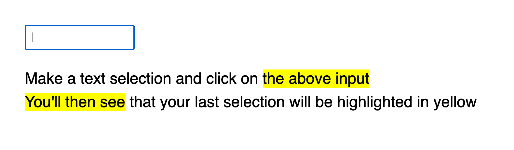

In this slate.js walkthrough we'll go over how to highlight selected text, when the focus isn't on your editor.

You might be wondering, why do we want to do that?

### Context 🤔

Picture the following scenario: You're designing an inline link UI. Which means you need to select some text and apply a link to it.



**Disclaimer:** Please bear in mind that this tutorial was tested with slate `0.62.1` and up.

### Let's get started

If you haven't yet, [create a new react app] and install slate, slate-history and slate-react.

```bash
npx create-react-app my-app
cd my-app
npm install slate slate-react slate-history --save
npm start # this will start your app
```

Below is some boilerplate for a basic slate editor, use this to get started. Don't forget to mount your Editor inside your root react component.

```tsx
import { createEditor } from "slate";
import { withHistory } from "slate-history";
import { Editable, Slate, withReact } from "slate-react";

function MyEditor()  {
  const editor = useMemo<ReactEditor>(() => withHistory(withReact(createEditor())) , [])

  const [value, setValue] = useState<Node[]>([
    {
      children: [{
        text: "Hello World"
      }]
    },
  ]);

  return <div>
    <input type="text" />
    <Slate editor={editor} onChange={setValue} value={value}>
      <Editable />
    </Slate>
  </div>
}
```

Please note the `<input type="text"/>` element, this is purely added for demonstration purposes. Clicking on it will move your cursor away from your slate editor, at which point we want to highlight the selection that was previously active (as shown in the above image).

To do this, we need to first capture the last active selection. Here's how:

```tsx
import { useSlate, Range } from 'slate'

export function EditableWithDecorate() {
  const editor = useSlate()
  const [lastActiveSelection, setLastActiveSelection] = useState<Range>()

  useEffect(() => {
    if (editor.selection != null) setLastActiveSelection(editor.selection)
  }, [editor.selection])

  return <Editable placeholder="Write something..." />
}
```

Above you'll see that we've created a separate component that renders `<Editable/>`. Our component needs to be nested inside a `<Slate/>` component so we can access the selection object.

### Capturing the last active selection

Inside our Editable component we need to first capture the last active selection. Let's create a state object for that:

```tsx
const editor = useSlate()
const [lastActiveSelection, setLastActiveSelection] = useState<Range>()
```

Now whenever the editor selection is active (i.e. when it is not null) we want to capture it with `setLastActiveSelection`. We can use the [`useEffect` hook] for this:

```tsx
  useEffect(() => {
    if (editor.selection != null) setLastActiveSelection(editor.selection)
  }, [editor.selection])
```

### Using decorate to create the leafs

We've capture the last active selection, now we need to tell slate to highlight the text range and we can do so with decorators. [Decorators are a way to manipulate the rendering of slate.js](https://docs.slatejs.org/concepts/09-rendering#decorations) content without updating the model itself. Useful for syntax highlighting, integration with parsers or use-cases like the one described in this tutorial.

In a nutshell, `decorate` is a prop on the `Editable` component. You can pass it a method, which will loop over every element in the document. The method must always return an array, which contains the decorations that are applied. A decoration is basically a [range](https://docs.slatejs.org/concepts/03-locations#range) extended with any properties of your choosing. As usual, slate is without opinions here, so in our case I will simply add a `highlighted` attribute.

```tsx
const decorate = ([node, path]) => {
  if (
    Text.isText(node) &&
    editor.selection == null &&
    lastActiveSelection != null
  ) {
    const intersection = Range.intersection(lastActiveSelection, Editor.range(editor, path))

    if (intersection == null) {
      return []
    }

    const range = {
      highlighted: true,
      ...intersection
    };

    return [range]
  }
  return [];
}
```

Let's break the above code snippet down a little.

```tsx
if (
  Text.isText(node) &&
  editor.selection == null &&
  lastActiveSelection != null
) 
```

We only want to highlight our last selection when:

1. It's a text node `Text.isText(node)` (decorators can be used for other nodes as well)
2. The Editor isn't actually selected `editor.selection == null`
3. And when the lastActiveSelection isn't null (duh)

There is a fourth factor that we need to take into account, the intersection of our selection and the current path that we're decorating over:

```tsx
const intersection = Range.intersection(lastActiveSelection, Editor.range(editor, path))
```

We need to do this because the selection could be crossing over multiple nodes.

If there is no intersection between our selection and our current node we know that this node should not be decorated:

```tsx
if (intersection == null) {
  return []
}
```

If it is however, then we can use the intersection range to decorate our node:

```tsx
const range = {
  highlighted: true,
  ...intersection
};
```

If none of our conditions become true, we `return []` so that no decorations are applied.

### Rendering our highlight

Now that we've written our decorator we need to add it pass it to our Editable component and render our highlights, we'll use the `renderLeaf` method for that:

```tsx
<Editable
  decorate={decorate}
  renderLeaf={(props) => {
    if (props.leaf.highlighted) {
      return <span {...props.attributes} style={{background: 'yellow'}}>{props.children}</span>
    }
    return <DefaultLeaf {...props} />
  }}
/>
```

Simple right? If `highlighted` is true, we render our leaf in a span with a yellow background, if not, we render the default leaf (which btw we'll need to import from `slate-react`)

The entire example code for this tutorial [can be found here](https://github.com/juliankrispel/slate-patterns/blob/master/src/highlight-last-selection/index.tsx), among others.

[`useEffect` hook]: https://reactjs.org/docs/hooks-effect.html
[create a new react app]: https://reactjs.org/docs/create-a-new-react-app.html