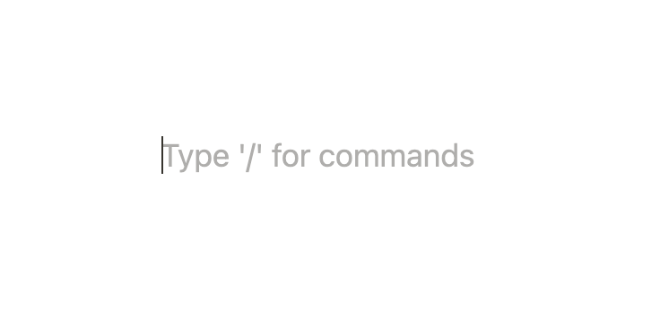

If you're building a text editing interface, there's a good chance you want to render a placeholder for empty lines/blocks to indicate a keyboard shortcut. Here's how that looks in [notion]:



In this tutorial I'll show you how to do this using [Slate.js decorators].

### Setting up

If you haven't yet, [create a new react app] and install slate, slate-history and slate-react.

```bash
npx create-react-app my-app
cd my-app
npm install slate slate-react slate-history --save
npm start # this will start your app
```

Use this boilerplate for a basic slate editor.

```tsx
import { createEditor } from "slate";
import { withHistory } from "slate-history";
import { Editable, Slate, withReact } from "slate-react";

function MyEditor()  {
  const editor = useMemo<ReactEditor>(() => withHistory(withReact(createEditor())) , [])

  const [value, setValue] = useState<Node[]>([
    {
      children: [{
        text: "Hello World"
      }]
    },
  ]);

  return <div>
    <input type="text" />
    <Slate editor={editor} onChange={setValue} value={value}>
      <Editable />
    </Slate>
  </div>
}
```

Don't forget to mount `MyEditor` in your root component (in create-react-app that'd be in `src/index.tsx`)
 
### Use decorate to decorate empty lines

[Decoration] is a slate api for modifying slate.js nodes before they are rendered. Without further ado, here's the code:

```tsx
<Editable
  decorate={([node, path]) => {
    if (editor.selection != null) {
      if (
        !Editor.isEditor(node) &&
        Editor.string(editor, [path[0]]) === "" &&
        Range.includes(editor.selection, path) &&
        Range.isCollapsed(editor.selection)
      ) {
        return [
          {
            ...editor.selection,
            placeholder: true,
          },
        ];
      }
    }
    return [];
  }}
/>
```

Let's break this down. We want to decorate nodes with `placeholder: true` when the following conditions are met:

1. The current node is not the Editor node: `Editor.isEditor()`
2. The current root node is empty: `Editor.string(editor, [path[0]]) === ""`
3. Our selection overlaps with the path our node is on: `Range.includes(editor.selection, path)`
4. Our selection is collapsed: `Range.isCollapsed(editor.selection)`

The `decorate` method is a prop on `Editable` component and always has to return an array, which is empty when no decorations are produced.

### Rendering the placeholder

We use the renderLeaf prop to render our placeholder since decorations are only applied to leaves:

```tsx
<Editable
  decorate={/* the decorate method we defined above, excluded for brevity */}
  renderLeaf={(props) => {
    if (props.leaf.placeholder) {
      return (
        <>
          <DefaultLeaf {...props} />
          <span
            style={{ opacity: 0.3, position: "absolute", top: 0 }}
            contentEditable={false}
          >
            Type / to open menu
          </span>
        </>
      );
    }
    return <DefaultLeaf 
      {...props}
    />
  }}
/>
```

Pretty simple. If `props.leaf.placeholder` is true we return the `DefaultLeaf` component alongside a span that looks like a placeholder. Don't forget to set `contentEditable` to false for this span, so slate does not try to handle user events that are emitted from the element (which usually causes issues).

Voilà, it's a wrap. The entire working code is available on my [slate-patterns](https://github.com/juliankrispel/slate-patterns/blob/master/src/element-placeholders/index.tsx) repository. Thanks for reading 👍

[notion]: https://notion.so
[Decoration]: https://docs.slatejs.org/concepts/09-rendering#decorations
[Slate.js decorators]: https://docs.slatejs.org/concepts/09-rendering#decorations