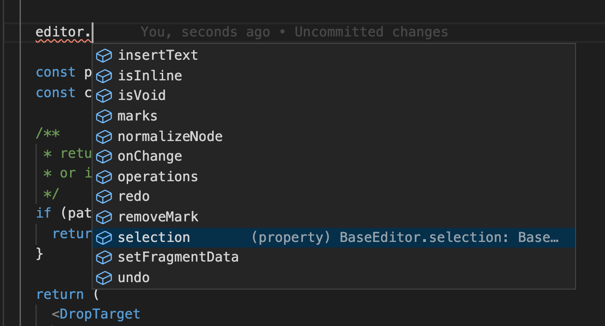

You're building the next big text-editing / note-taking based startup and need a powerful library that integrates with react.

A search that will most likely lead you to the inevitable fork in the road: Should you use [__Draft.js__](https://draftjs.org/) or [__Slate.js__](https://www.slatejs.org/)?

What follows is a comparison based on facts, opinions and experience working with both draft.js and slate.js as a text-editing consultant for several years.

**tl;dr** - As of today, I recommend slate.js over draft.js to all who start working on text-based interfaces.

|                           | Draft.js                                      | Slate.js                                                   |
| --                        | --                                            |  --                                                        |
| Licensing                 | MIT                                           | MIT                                                        |
| Type System               | Uses [Flow], 3rd party [typescript support]   | Written in typescript                                      |
| Data structure            | [Immutable.js]                                | [immer]                                                    |
| Size                      | ~170kb incl deps                              | ~80kb incl deps                                            |
| Maturity / Stability      | very stable, used by facebook                 |  Still in beta, frequent breaking changes                  |
| Size                      | ~170kb incl deps                              | ~80kb incl deps                                            |
| Documentation             | 😑 Covers basics and some in-depth topics     | 😑 Covers basics and some in-depth topics                   |
| Tree (e.g. Table) support | ❌ None                                       | ✅ Supports any kind of tree structure at any depth         |
| Mobile support            | ❌ None                                       | ✅ Supports mobile browsers, android in the works           |
| Collaborative editing     | ❌ None                                       | ❌ None but operations lend themselves to implement OT      |
| Open source               | 👎 Seeminingly unmaintained                   | 🚀 Well maintained, open to contributions                   |

### Licensing

Fortunately, both projects use MIT at the time of writing this article. This wasn't always the case for Draft.js (nor React.js). After significant [public outcry] over facebooks previous (predatory) licensing model draft.js [was relicensed to use the MIT license](https://github.com/facebook/draft-js/pull/1967).

### Type system

Slate.js uses Typescript and has excellent support for it. For example, with the current release users are able to define the [type of their content schema](https://docs.slatejs.org/concepts/12-typescript#defining-editor-element-and-text-types).

Draft.js on the other hand uses [Flow], Facebooks alternative type checker. While Flow is a great project it does not have the same momentum and reach that Typescript has.

However, [@typed/draft-js] is an npm package that enables typescript support for draft.js, making this much less of a problem.

### Data structure

Draft.js uses immutable.js whereas slate.js uses immer.js. Not only does immer.js have a much smaller impact on bundle size, it also makes for a much better experience!

With immer, you can use the regular data structures you know and love (objects, arrays etc).
With Immutable.js you have to use explicit APIs to make changes or log your state. Typing `.toJS()` everytime you want to inspect your current `EditorState` gets on one's nerve pretty quickly.

### Size

Draft.js: ~ 170kb incl deps
Slate.js: ~ 80kb incl deps

Size matters. Currently Including dependencies slate.js clocks in at less than half the size of draft.js. Draft.js's dependency on immutable.js makes up a lot of that.

### Documentation

Both slate.js and draft.js have large APIs, for better or worse.

Although both projects have decent documentation to cover the basics of either, the rabbit hole is never-ending and there are countless edge-cases and quirks, some due their design, most due to the way that contentEditable and the related DOM INPUT APIs were designed and implemented (often differently by different browsers).

As a user of either library you will eventually find yourself looking at the source code. Fortunately typescript makes this a lot easier (especially if your IDE supports)

### Maturity / Stability

Slate.js is still in beta and as such breaking changes and regressions are not uncommon at this stage. However this is also intentional, Slate has gone through a few iterations and as a project has taken it's time to arrive at an API that works for it's users.

When it comes to stability Draft.js wins overall since it has been stable pretty much since it's first release (It is being used inside the most used web-app online after all).

### On features such as tree nodes and mobile support

Support for nested nodes in draft.js has been a long awaited / often promised feature (think tables). There is no [shortage of attempts](https://github.com/facebook/draft-js/pull/388) to add tree support by the open source community but due to the way the draft.js open source project is run none of the contributions were ever accepted and merged.

Slate.js on the other hand has had support for tree structures from the get go.

Support for mobile browsers is a similar story and slate.js takes the lead here with big community led contributions to support android browsers.

### A few words on architecture

Draft.js is one big bundle whereas slate.js has a headless core and a separate package for the view layer (`slate-react`). Because of this separation slate can be used server-side or with other view layers (Shoutout to [tiny](tiny.cloud) and Andrew Herron who are using slate with tiny MCE).

Another advantage of slate's architecture is that every change in a slate document is expressed as an `Operation` - a serializable object that represents a change. This model is essential to enabling [Operational Transformation](https://en.wikipedia.org/wiki/Operational_transformation) - a family of algorithms for collaborative editing.

### Open source

For the curious - one comparison would be the [commit history of draft.js](https://github.com/facebook/draft-js/commits/master) vs [that of slate](https://github.com/ianstormtaylor/slate/commits/main). Have a look for yourself and you'll see what kind of commits make it into master.

Draft.js is seemingly abandoned by facebook. Other than regular automated maintenance and one off bugfixes, community-led contributions even when they provide value and align with the roadmap seem impossible.

Having been involved with both projects I found slate.js is far better managed more open to contributions. If you want to contribute, all you have to do is open a pr. If it doesn't get addressed as soon as you'd like, join [the very active community on slack](https://slate-slack.herokuapp.com/), all the contributors and maintainers hang out there too and will respond to questions and feedback. Kudos to [Ian](https://twitter.com/ianstormtaylor) for his os leadership here, tremendous work!

[Flow]: https://flow.org
[typescript support]: https://www.npmjs.com/package/@types/draft-js
[Immutable.js]: https://immutable-js.github.io/immutable-js/
[immer]: https://github.com/immerjs/immer
[public outcry]: https://www.freecodecamp.org/news/facebook-just-changed-the-license-on-react-heres-a-2-minute-explanation-why-5878478913b2/
[@typed/draft-js]: https://github.com/DefinitelyTyped/DefinitelyTyped/tree/master/types/draft-js