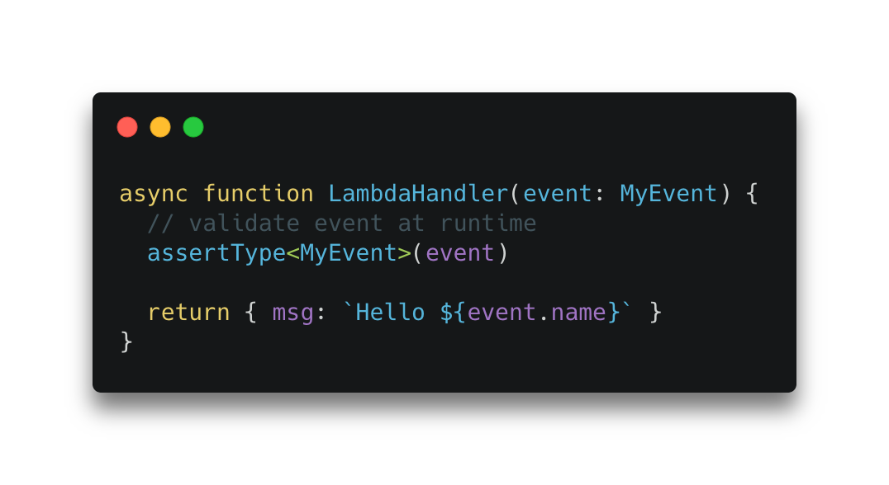

[typescript-is](https://github.com/woutervh-/typescript-is) is a library which enables type checks at run-time! This is an incredible tool to validate input and make your code more type-safe 🎉.

Validating the input of cloud functions can be a challenging problem. Re-using your types to ensure that your input matches your type solves a big part of the validation problem. To do this with the `typescript-is` library, the only thing you need to do is to use the `assertType` method that `typescript-is` exports:

```ts
// 2. Use the `assertType` method to perform your runtime check
assertType<MyEvent>(input)
```

Above we use `assertType` to check whether our runtime object `input` matches our type `MyEvent`. If it doesn't match the `MyEvent` type, an error is thrown. `typescript-is` has a bunch of other methods such as `is` or `strictEqual`. If you'd like to throw the error yourself you could do this for example:

```ts
if (!is<MyEvent>(input)) {
  throw new Error('input does not match type')
}
```

That's pretty much all it takes to add a run-time type check of your cloud functions input (provided you are a typescript user 🙃). Whereas previously you might have reached for validation libraries such as [joi](https://github.com/sideway/joi) or god-forbid, written your own validator, it's now just one line of code. What are you going to do with all this new-found time?

Below is the entirety of an AWS lambda function handler with this pattern applied:

```ts
import { Handler } from 'aws-lambda'
import { assertType } from 'typescript-is';

type MyEvent = {
  msg: string
}

async function handler<Handler>(event: MyEvent) {
  assertType<MyEvent>(event)
  return { msg: 'Hello World' }
}

exports.handler = handler
```

🚀

For a fully working example of this pattern including deployment scripts for AWS and compilation with webpack please have a [look at this boilerplate I've put together](https://github.com/juliankrispel/typescript-aws-lambda-terraform).
