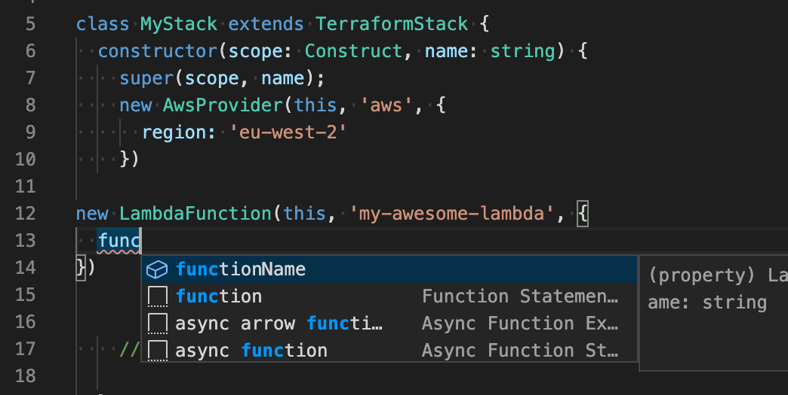

You may or may not have heard about the release of the [terraform cdk](https://github.com/hashicorp/terraform-cdk) (short for cloud development kit). It's HashiCorps answer to the aws cdk. In the words of the projects readme:

> CDK (Cloud Development Kit) for Terraform allows developers to use familiar programming languages to define cloud infrastructure and provision it through HashiCorp Terraform.

Let's try this out shall we?

To get the full developer experience, make sure you have [typescript support installed for your IDE](https://github.com/Microsoft/TypeScript/wiki/TypeScript-Editor-Support)



### Generating the boilerplate

Let's open our terminal and install install cdktf-cli:

```bash
npm install -g cdktf-cli
```

Next we'll initialize the project

```bash
mkdir hello-cdktf
cd hello-cdktf
cdktf init --template="typescript" --local
```

Answer the two configuration questions and the project boilerplate will be generated.


Now we should see a `main.ts` file with the following contents in our folder:

```ts
import { Construct } from 'constructs';
import { App, TerraformStack } from 'cdktf';

class MyStack extends TerraformStack {
  constructor(scope: Construct, name: string) {
    super(scope, name);

    // define resources here

  }
}

const app = new App();
new MyStack(app, 'hello-cdktf2');
app.synth();
```

### Adding a provider package and importing modules from it

After generation finishes you'll see a message in the console listing instructions of what to do next. To add the prebuilt aws provider (which also gives us all the modules and types that we might want).

```bash
npm install -a @cdktf/provider-aws
```

Now you can import modules from `@cdktf/provider-aws` such as `AwsProvider` and others. We'll go for the `AwsProvider`, `LambdaFunction` and `IamRole`. Add this at the top of your file:

```ts
import { AwsProvider, LambdaFunction, IamRole } from '@cdktf/provider-aws';
```

and then create an AwsProvider in your stack:


```ts
new AwsProvider(this, 'aws', {
  region: 'eu-west-2'
})
```

### Adding a lambda function to our stack

To create a lambda we need to define an IAM role at first. Boring, but made easier by autocomplete of cours. Anyway here's the default policy:

```ts
const roleForLambda = new IamRole(this, 'iam-role-for-lambda', {
  name: 'iam-role-for-lambda',
  assumeRolePolicy: JSON.stringify({
    "Version": "2012-10-17",
    "Statement": [
      {
        "Action": "sts:AssumeRole",
        "Principal": {
          "Service": "lambda.amazonaws.com"
        },
        "Effect": "Allow"
      }
    ]
  })
})
```

Now we can add a lambda function to the stack like this:

```typescript
new LambdaFunction(this, 'hello-world', {
  filename: process.cwd() + 'hello-world.zip'
  functionName: 'hello-world',
  handler: 'index.handler',
  runtime: 'nodejs12.x',
  role: roleForLambda.arn,
})
```

You will need to zip your lambda function - which is usually a separate step before running terraform. For example sake, let's say you have a file in your project named `hello-world.js`:

```js
export const handler = async function () {
  return { hello: world }
}
```

Then zip your lambda `zip -r lambda.zip hello-world.js`

### Deploying your stack

Before you deploy don't forget need to [have your aws credentials in your path](https://docs.aws.amazon.com/cli/latest/userguide/cli-configure-files.html).

Now that you have everything ready you can deploy your stack with `cdktf deploy`. This command will display an execution plan and ask you if you want to deploy. Press the `Y` and `Enter` key to deploy.

Any errors at this stage should be farely self-explanatory. If they don't make sense, google the error message - other people have likely run into the same problem.

---

If you're a terraform user and you've used the `lambda_function` module before, you'll notice that the configuration is exactly the same.

Ultimately, when you run `cdktf synth` cdktf compiles your javascript/typescript modules into terraforms alternative [`JSON` configuration syntax](https://www.terraform.io/docs/configuration/syntax-json.html).

This is an extremely powerful feature of terraform's design since it can be a compile target not just for javascript and typescript, but any kind of language. The open source community could add it's own language compilers.

Why not write one in rust? 😅
