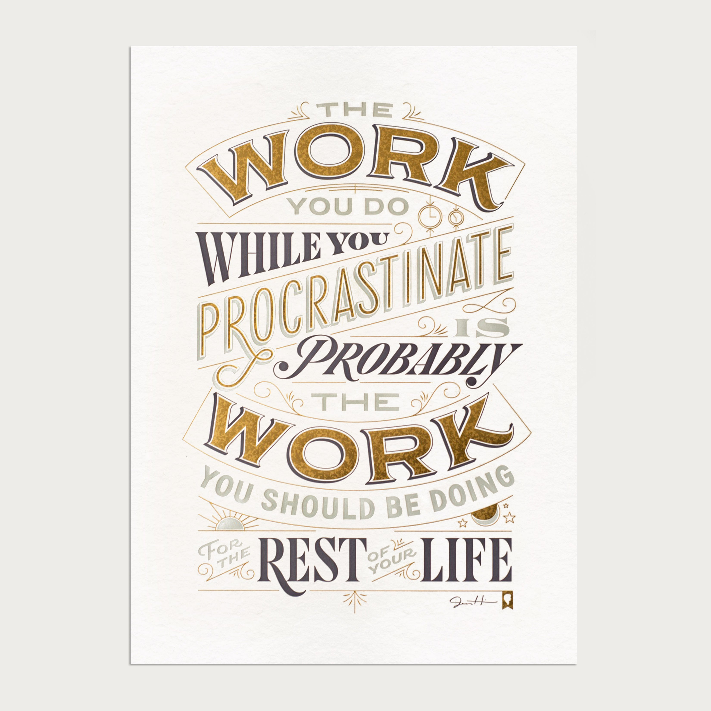

__Software Engineering is booming 📈 and there's never been a better time to start freelancing.__

Being in the middle of a pandemic you may think a move like this would be too risky.

That's what I thought when I transitioned from full time employment to __working for myself__ earlier this year - albeit for the second time in my ~12 year long career as a Software Engineer.

An anniversary begets reflection, so here's a post on __12 things I learned, forgot and relearned__ as a freelancer. To help me remember and to hopefully help others on the way to a successful freelance career 🙏

__Disclaimer:__ A lot of the advice in this blogpost is not original. Some if it I had read on other blogs or heard from my peers but was too stubborn to take on board until I'd learned the lessons myself.

## 1. There are no limits to what you can achieve 🚀

When you are employed by someone, there are always limits, such as:

- __A holiday allowance__. Don't tell me your company offers the unlimited variety because there is no such thing even if they say so 😉
- __A pay structure__. Although these limits are increasing with the demand for software Engineers and are at an all time high - companies will limit how much they pay there employees. It's a necessity to running a business.
- __Your role__. As an employee, unless you fill an executive role you will have little influence over the overall direction of the company. Your job will be defined by your role which comes with limits some of which will be spelled out in your onboarding, some will be unspoken and some boundaries will only be apparent when you push on them.

Of course as a company it's good practice to define these boundaries, but for the self-employed none of these boundaries apply:

- You an take as much holiday as you please, literally.
- The price for well written software and good consultancy has no ceiling 💰 and therefore your possible salary is whatever you can think of (make up a number and double it).
- As a company of one you have sole discretion over where to take it. I found this can be equally overwhelming and freeing.

Let this sink in. Let the possibilities and dreams you have be a driver. The road will likely be long and hard but you can take my word for it - there is treasure at the end of the rainbow, I've seen it with my own eyes and recently I think I may be edging closer.

## Your content is your most important asset

If you were to take anything away from this blog this should be it. Whether you:

- Publish video or streaming content on youtube / vimeo / twitch
- Contribute to open source projects on github, people look at who contributed to those.
- Write a blog on one of the many publishing platforms or your own self-hosted blog (learn about basic [SEO](https://developer.mozilla.org/en-US/docs/Glossary/SEO) if you do)
- Become an video instructor, [shoutout to egghead](https://howtoegghead.com/)

Make content and put it somewhere on the Internet. This is how your customers will find you.

## Find your niche and own it

The desire to learn is a pre-requisite to becoming a Software Engineer which makes it seem unintuitive that being a "full-stack engineer for hire" doesn't automatically get you a job, even if that describes your abilities most accurately.

It all comes down to messaging and numbers. Put yourself into your customers shoes. They are looking for an engineer to help them build some software. Whether they run a small firm or lead an engineering team of 100, they will most likely be looking for someone who has a track record of experience in his particular field. What worked for me was to specialise in building text editors.

If you find a niche that you truly love, it can feel like more of a calling than a job. Sounds cheesy but it rings true for many. If you have too many interests in your work to know which one to pick, pick more than one and see how it goes, get a feel for it etc. Try out writing blog posts on different topics and see how they perform if you're stuck.

- Contribute to open source projects in your niche.

Niches fragment into smaller niches. What may have been a niche 5 years ago could be multiple niches now.

## Always have a side-project

Here's a piece of advice that actually stuck with me throughout my career:

> The work you do while you procrastinate is probably the work you should be doing for the rest of your life

The advice is by my favorite letterer, [Jessca Hische](https://www.jessicahische.is/):

What I took from it is this: Always do "work" that isn't your main gig. Even when full-time employed, make room for a side-project.

You don't have to complete it, or make money from it. All that matters is that this side-project excites you.

Whether this is a side project with a friend or by yourself, contributing to open source or just building something following a tutorial, the simple act of doing something other than your main gig helps you imagine what's possible. This was key to help ease me into freelancing, both times I attempted it.

## Moonlighting is a gateway to freelancing

The easiest path into freelancing is to try it out without leaving your job. This can take many forms - You could reduce your hours with your employer to support a client, or you could keep working full time and support your client on your time off. Whatever you do, be upfront with your current employer about this unless you don't mind the risk of disciplinary action.

The likelihood is that they'd rather keep you than loose you to another company entirely. If they don't then they're not worth their salt anyway.

## Failure is not the end

I've lost count of the amount of times I thought I had failed at freelancing or generally - at this career.

- Failure is not a low follower count on twitter or that your tweets don't get seen enough.
- Failure is not going back to full-time employment, just another opportunity for another attempt later on.
- Failure is not having no clients for a month or two.
- Failure is not being unable to achieve overnight success, you have to play the long game...

## Always play the long game

Of course, existential needs such as

## The later you are in your career the better

If you want to freelance as a Software Engineer but are just starting out, I'd recommend getting a full time job before you do. The more time you've spent gathering experience and honing your craft as a software engineer the easier it'll be to freelance.

## Two clients are better than one

Once you are working for yourself full-time, try to have at least 2 clients or more. Here's why:

- Over-reliance on one client is unhealthy for your business
- In the UK it is sometimes necessary to avoid being double taxed under IR35 (I know of at least one other European country that has similar legislation)
- As a business owner you need to know what's next. If you're already talking to another client it'll be easier to plan for the future.

Think of freelancing as an open relationship. You should always stay open to talking to and courting new clients. Being approachable will help you upgrade your hourly rate.

## Be organized

This is definitely something I had to work on.

- Read the contracts you sign. Have someone else help you if you don't have the headspace.
- Pay bills on time and remind your clients to pay bills on time.
- Use accounting software and hire an accountant.
- Take notes. Write down what you do.
- If you do hourly work, be clear about what you do in your timesheet.
- Adapt to the customs of your client. You are an extension of them and must be an example especially if you're helping a team.

## Look for lessons wherever you can

Everything is about learning and doing. Subscribing to[Jonathan Frank's](https://jonathanstark.com/) email and reading blogs on value pricing has opened my eyes to value pricing and thinking about pricing in that way. This understanding is key to . This is definitely a "The more I learn the less I know" scenario. The more I learn and practice different pricing strategy
- People like Jonathan frank
I'm no expert at this but there more than a few people online who can give excellent advice

## Be generous with your time

- 

## Setting boundaries

- 

